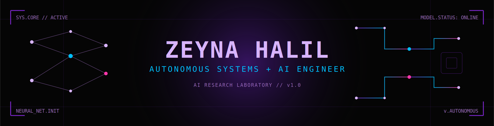
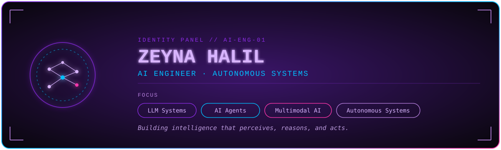

<!-- static AI research-lab banner — save the accompanying hero-banner.png to ./assets/hero-banner.png -->

 

  

 

##  About Me

<!-- AI identity panel — save the accompanying about-card.svg to ./assets/about-card.svg -->

 

##  AI Expertise

<table width="100%">
<tr>
<td width="50%" valign="top">

**🧠 LLM ENGINEERING**

Designing intelligent language systems — from prompt architecture to production assistants.

  

</td>
<td width="50%" valign="top">

**🔎 RAG ARCHITECTURES**

Vector-based retrieval systems connecting knowledge bases to reasoning models.

  

</td>
</tr>
<tr>
<td width="50%" valign="top">

**🤖 AI AGENTS**

Multi-agent systems that plan, delegate, and execute autonomous decision workflows.

  

</td>
<td width="50%" valign="top">

**👁 MULTIMODAL AI**

Vision + language systems fused for real-world perception and understanding.

  

</td>
</tr>
</table>

 

##  Technology Ecosystem

`◈─────────────────────────── SYSTEM MAP ───────────────────────────◈`

<table width="100%">
<tr>
<td width="100%" align="center">

**🧠 AI CORE**
 

</td>
</tr>
<tr>
<td width="100%" align="center">

**👁 COMPUTER VISION**
 

</td>
</tr>
<tr>
<td width="100%" align="center">

**🤖 AUTONOMOUS SYSTEMS**
 

</td>
</tr>
</table>

`◈──────────────────────────────────────────────────────────────────◈`

**CORE LANGUAGES**

 

##  Featured Projects

<table width="100%">
<tr>
<td width="50%" valign="top">

### 🤖 AI Multi-Agent Platform

An intelligent agent ecosystem combining LLM reasoning, retrieval, and autonomous workflows — built for public-sector deployment.

**Stack:**    

**Impact:** Unified multi-agent orchestration across retrieval, reasoning, and task execution.

</td>
<td width="50%" valign="top">

### 🛰 Autonomous Systems Research

AI-driven autonomous platforms fusing robotics, perception, and real-time decision-making for navigation and interaction.

**Stack:**    

**Impact:** Perception-to-action pipeline for autonomous platform navigation.

</td>
</tr>
</table>

 

## 🧪 AI LAB — Active Research

<table width="100%">
<tr>
<td width="50%">

`⟶` **LLM Fine-Tuning** — adapting foundation models to specialized tasks
`⟶` **RAG Architectures** — retrieval pipelines for grounded generation
`⟶` **Multimodal AI** — vision-language fusion for perception systems

</td>
<td width="50%">

`⟶` **Computer Vision** — real-time detection & scene understanding
`⟶` **Autonomous Decision Systems** — agentic planning under uncertainty
`⟶` **Agentic Workflows** — multi-agent coordination architectures

</td>
</tr>
</table>

 

##  Achievements

🏆 **FinTech Competition Award** — 1st Place, Istanbul Gelişim University FinTech Category

 

// COMPILING ACTIVITY LOG...

 

##  GitHub Analytics

<picture>
  <source media="(prefers-color-scheme: dark)" srcset="https://raw.githubusercontent.com/platane/snk/output/github-contribution-grid-snake-dark.svg" />
  
</picture>

  

 

 

Engineering the systems that will think, perceive, and act on their own.

